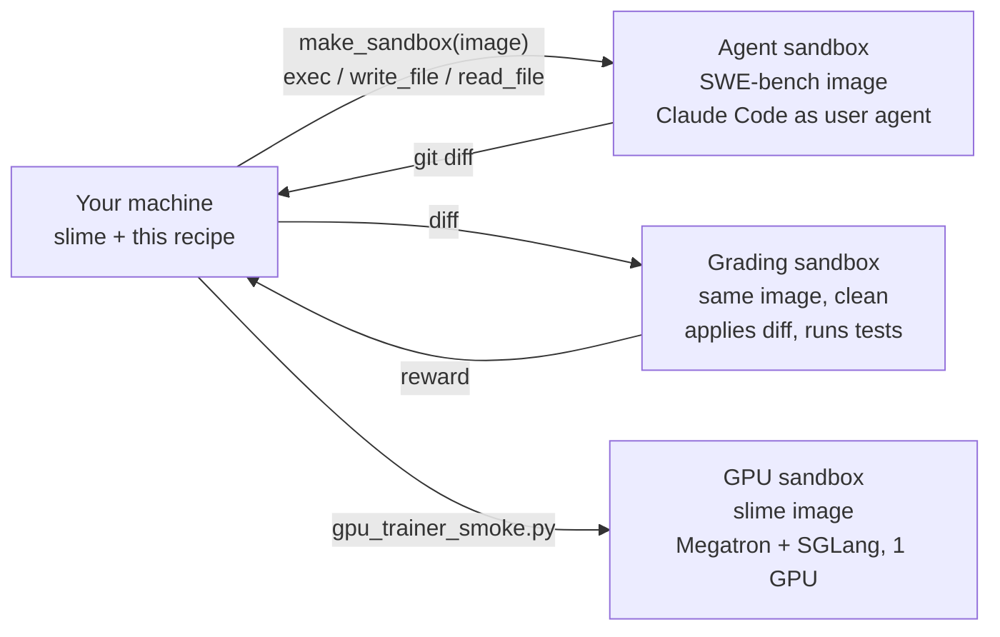

# Run slime coding-agent RL rollouts on CoreWeave Sandboxes

[slime](https://github.com/THUDM/slime) is an RL post-training framework
(Megatron + SGLang). Its coding-agent example gives every rollout a fresh
sandbox. A real agent (Claude Code) edits a repository inside it, and the
diff is graded in a second, clean sandbox built from the same image. This
recipe plugs CoreWeave Sandboxes in as that sandbox provider. It verifies
the pipeline on a SWE-bench Verified task, then runs slime's own single-GPU
training smoke test in a GPU sandbox.

## What this recipe demonstrates

- A drop-in slime sandbox backend, [`slime_cwsandbox.CWSandbox`](slime_cwsandbox.py), selected with one environment variable and no slime code changes.
- slime's unmodified sandbox pipeline on a SWE-bench Verified instance: agent sandbox, Claude Code install and run, diff capture, and grading in a fresh sandbox.
- Separate agent and grading sandboxes, so the agent never sees the held-out tests.
- slime's colocated GRPO step (Megatron training and SGLang rollouts on one GPU) inside a GPU sandbox.

## Architecture



| Component | Runs in |
|---|---|
| slime rollout code, this recipe's scripts | your machine |
| Agent and grading environments | CPU sandboxes (serverless by default) |
| slime trainer smoke test | one GPU sandbox |

In a full training run the slime rollout code runs on the Ray cluster next to
SGLang, and each agent sandbox calls back to slime's model adapter on the
training host. Here, [`stub_anthropic.js`](stub_anthropic.js) stands in for
that adapter inside the agent sandbox, so steps 1 and 2 need no GPU. See
[Use it in a slime training run](#use-it-in-a-slime-training-run) for the
callback requirements.

## Prerequisites

- Python 3.11 or 3.12, [uv](https://docs.astral.sh/uv/getting-started/installation/), Git, and npm (for `npm pack`).
- A [CoreWeave API access token](https://docs.coreweave.com/products/sandboxes/placement#coreweave-api-access-token) with serverless sandbox access. Step 3 also needs GPU sandbox access.
- A slime checkout that includes the sandbox backend selector. Until [THUDM/slime#2447](https://github.com/THUDM/slime/pull/2447) is merged, use that pull request's branch (Setup step 1).

**Resources and cost.** These are metered; check your
[sandbox billing terms](https://docs.coreweave.com/products/sandboxes/placement).
- Step 1 uses one sandbox (2 vCPU / 4 GiB) for about 2 minutes.
- Step 2 uses three sandboxes of the same size for about 5 minutes: one agent sandbox, then two grading sandboxes in parallel.
- Step 3 uses one GPU sandbox (1 GPU, 8 vCPU, 32 GiB) for 5 to 10 minutes. Most of that is the first pull of the ~20 GiB slime image on a node.

Every sandbox has a one-hour server-side lifetime cap.

## Setup

1. Clone slime with the backend selector (the branch behind THUDM/slime#2447; switch to upstream `main` once it merges):

   ```bash
   git clone -b sandbox-backend-hook https://github.com/brandonrjacobs/slime.git ~/slime
   ```

2. Install this recipe's locked dependencies and configure it:

   ```bash
   uv sync --frozen
   cp .env.example .env
   # set CWSANDBOX_API_KEY and SLIME_DIR (e.g. /home/you/slime)
   ```

3. Download the host-side tarballs slime's Claude Code harness uploads into each agent sandbox, and copy the two printed lines into `.env`:

   ```bash
   uv run --frozen python fetch_assets.py
   ```

   ```text
   SLIME_AGENT_NODE_TARBALL=/.../assets/node-v22.23.3-linux-x64.tar.xz
   SLIME_AGENT_CC_TARBALL=/.../assets/anthropic-ai-claude-code-2.1.292.tgz
   ```

## Run

1. Check the backend against slime's sandbox contract. This covers exec as root and as the agent user, environment passthrough, file ownership, a 40 MiB streamed upload, reads, and a 70-second detached job:

   ```bash
   uv run --frozen --env-file .env python check_backend.py
   ```

   ```text
   [PASS] make_sandbox returns CWSandbox
   [PASS] sandbox running 1f0c... in 12s
   ...
   [PASS] exec_and_wait detached job 73s

   11/11 passed
   ```

2. Run one SWE-bench Verified instance through slime's pipeline. The default is `astropy__astropy-12907`; pass `--instance-id` for another. The dataset's reference patch stands in for the model's edit, so grading should resolve the instance. An empty diff is graded too, as a control.

   ```bash
   uv run --frozen --env-file .env python swe_pipeline.py
   ```

   ```text
   [PASS] instance is gradable swebench/sweb.eval.x86_64.astropy_1776_astropy-12907:latest
   [PASS] agent sandbox booted, Claude Code installed 90s
   [PASS] swe.prepare_workspace
   [PASS] Claude Code ran as the agent user against the adapter exit=0 calls=1 7s
   [PASS] swe.git_diff captured the edit 13 lines
   [PASS] grading sandbox: reference patch resolves (reward 1.0) 110s
   [PASS] grading sandbox: empty diff does not (reward 0.0)

   7/7 passed
   ```

   The first run on a node pulls the instance image (about 1 GiB). Installing Claude Code in the sandbox downloads its platform binary from the npm registry, so the agent sandbox needs outbound access.

3. Run slime's single-GPU GRPO smoke test in a GPU sandbox. This is one rollout, reward, Megatron update and weight sync to SGLang, with Qwen2.5-0.5B-Instruct on dapo-math-17k. The script picks the first GPU type your runners advertise; set `GPU_TYPE` to choose.

   ```bash
   uv run --frozen --env-file .env python gpu_trainer_smoke.py
   ```

   ```text
   sandbox 5e90...: slimerl/slime:nightly-dev-20260930a-cu129 on 1x <gpu type>
   running after 19s (first pull of the ~20 GiB image is slowest)
   [ok] model and dataset downloaded
   [ok] checkpoint converted to torch_dist
   rollout 0: {...}
   step 0: {'train/loss': ..., 'train/train_rollout_logprob_abs_diff': 0.0118..., ...}
   ... Job 'raysubmit_...' succeeded
   PASS: exit 0 after 303s
   stopped 5e90...
   ```

   A node that hasn't pulled the image yet adds about 3.5 minutes before `running`.

   This is a plumbing test: with a 256-token response cap, most samples truncate and score 0, so the update can be zero. `train_rollout_logprob_abs_diff` near 0.01 means Megatron and SGLang agree on the sampled tokens.

## Use it in a slime training run

Set these on the Ray head and propagate them to the workers. The example launcher, `examples/coding_agent_rl/run_qwen36_35b_a3b_swe_8nodes.sh`, builds the runtime env from a fixed key list, so add the `CWSANDBOX_*` and `SLIME_AGENT_CWSANDBOX_*` keys there:

```bash
export SLIME_AGENT_SANDBOX_BACKEND=slime_cwsandbox.CWSandbox
export PYTHONPATH="/path/to/this/recipe:${PYTHONPATH}"   # slime_cwsandbox must import on every worker
export CWSANDBOX_API_KEY=...
export SLIME_AGENT_CWSANDBOX_PLACEMENT_MODE=serverless
export ADAPTER_PUBLIC_HOST=<address the sandboxes can reach>
```

Each agent sandbox calls slime's model adapter at `http://$ADAPTER_PUBLIC_HOST:$ADAPTER_PORT`. That address must be reachable from the sandboxes over the network they egress through. A private Ray-head IP is not enough for serverless sandboxes. Grading sandboxes make no outbound calls.

Backend settings are documented in [`slime_cwsandbox.py`](slime_cwsandbox.py). The defaults are 2 vCPU / 4 GiB per sandbox, a 3600-second lifetime, and a 900-second limit for create plus the image pull.

## Results

Each script prints one `[PASS]` or `[FAIL]` line per check and exits non-zero on any failure. Nothing is uploaded; slime's own rollout dumps and metrics apply in a real training run.

## Cleanup

The scripts stop their sandboxes on exit, including on failure. To catch leftovers from an interrupted run, stop everything carrying the recipe's tag:

```bash
uv run --frozen --env-file .env python cleanup.py --dry-run
uv run --frozen --env-file .env python cleanup.py
```

Delete `assets/` to remove the downloaded tarballs.

## Tests

Offline tests use a fake SDK and need no credentials:

```bash
uv run --frozen pytest
```
