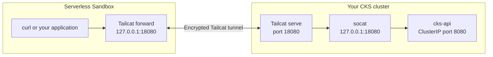

# Private CKS connectivity with Tailcat

Call a private Kubernetes Service in [CoreWeave Kubernetes Service (CKS)](https://docs.coreweave.com/products/cks) from a [Serverless Sandbox](https://docs.coreweave.com/products/sandboxes). The CKS Service stays `ClusterIP`. Tailcat carries the HTTP request through an encrypted tunnel without an Ingress or a public sandbox endpoint.

Start with **sandbox → CKS** below. Then use [reverse.md](reverse.md) for **CKS → sandbox** and **CKS → sandbox → CKS**.

**Resources and cost:** CPU only; no GPUs. Each run requests one sandbox with 1 vCPU and 1 GiB RAM, capped at 30 minutes: at most 0.5 vCPU-hours and 0.5 GiB-hours of requested sandbox capacity. The CKS demo requests 200 millicores and 224 MiB across two pods; the optional caller adds 100 millicores and 128 MiB for up to three minutes. Use an existing CKS cluster with spare capacity. Cost depends on your sandbox rates, existing CKS nodes, registry storage, and network charges. CKS Deployments keep running until you delete them in the cleanup step.

## How it works



The bridge pod has two containers sharing its network namespace. `socat` maps a loopback port to the Service's DNS name; `tailcat serve` exposes that loopback port. In the sandbox, `tailcat forward` makes it available at `http://127.0.0.1:18080/`. Your application uses normal HTTP.

Tailcat runs in userspace, so this recipe needs no privileged containers, host networking, or TUN device. Its WireGuard tunnel bootstraps through a DERP relay and can switch to direct UDP when the networks permit it. Traffic may traverse public relays; “private” here means encrypted, credential-protected access, not a dedicated private network link. See [Tailcat's architecture](https://github.com/tailscale/tailcat/blob/v0.7.0/README.md).

### Why there is no tailnet login

Tailcat does not use Tailscale's account/control plane. The generated `tc…` address contains connection metadata and a secret WireGuard pre-shared key. This demo authorizes clients by possession of that address; it has no additional HTTP authentication. CoreWeave credentials and kubeconfig authorize provisioning and secret transfer, separately from the tunnel.

Treat addresses as credentials: never paste them into tickets, logs, or commits. This recipe stores them in private files or Kubernetes Secrets and redirects Tailcat's stdout **and** stderr. Each server uses `--key=new`; stopping or restarting it invalidates the old address. For named client identities, Tailcat also supports `serve --allow=<client-public-key>`; see its [key management guide](https://github.com/tailscale/tailcat/blob/v0.7.0/README.md#key-management).

## Prerequisites

- A CKS cluster and kubeconfig with permission to create a dedicated `tailcat-demo` namespace, Deployments, a Service, Secrets, and Jobs, and to exec into the demo pods. Follow [CKS API access setup](https://docs.coreweave.com/security/authn-authz/manage-api-access-tokens).
- A CoreWeave API access token with `SANDBOX_USER` access and serverless capacity available. Follow [Sandbox setup](https://docs.coreweave.com/products/sandboxes/get-started#run-a-sandbox-on-serverless-capacity). Serverless placement is explicit; no sandbox runner installation in your CKS cluster is required.
- Python 3.11+, [uv](https://docs.astral.sh/uv/getting-started/installation/), `kubectl`, Docker with Buildx, and `envsubst` (GNU gettext). Commands assume Bash or Zsh on macOS/Linux.
- A container registry you can push to. For these commands, the resulting image must be readable without registry credentials by both CKS and Sandboxes. The image contains only demo code and tools. Using a private image instead requires configuring image-pull credentials on both platforms.
- Outbound DNS and HTTPS access from both environments to Tailcat's DERP map and relays. The bridge also needs DNS and TCP access to your Service. Optional UDP permits direct peer connections. Existing network policies still apply; an egress-denied sandbox will not work.

Tailcat is experimental. Its default public relays are rate-limited and have no SLA; review the upstream [security notes](https://github.com/tailscale/tailcat/blob/v0.7.0/SECURITY.md) before using this pattern with sensitive workloads.

## Run: sandbox → CKS

### 1. Configure credentials and build the image

From this recipe directory:

```bash
cp .env.example .env
chmod 600 .env
# Edit .env with your token, image tag, and CKS context.
set -a
source .env
set +a

uv sync --frozen
kubectl --context "$KUBE_CONTEXT" cluster-info
docker buildx build --platform linux/amd64,linux/arm64 \
  --tag "$TAILCAT_IMAGE" --push .
```

The Dockerfile pins Tailcat v0.7.0 by digest. Both platforms use the same demo image, running as UID 10001. The Docker build context includes only the Dockerfile and demo HTTP server; `.env` and generated addresses are excluded.

### 2. Deploy the private Service and bridge

Use a new `tailcat-demo` namespace dedicated to this example. Cleanup deletes this namespace and everything in it.

```bash
envsubst '${TAILCAT_IMAGE}' < k8s/service.yaml \
  | kubectl --context "$KUBE_CONTEXT" apply -f -
envsubst '${TAILCAT_IMAGE}' < k8s/bridge.yaml \
  | kubectl --context "$KUBE_CONTEXT" apply -f -

kubectl --context "$KUBE_CONTEXT" -n tailcat-demo \
  rollout status deployment/cks-api --timeout=180s
kubectl --context "$KUBE_CONTEXT" -n tailcat-demo \
  rollout status deployment/cks-bridge --timeout=180s
kubectl --context "$KUBE_CONTEXT" -n tailcat-demo get service cks-api
```

Expected: both Deployments roll out successfully, and `cks-api` has type `ClusterIP` with no external IP. The bridge has no Kubernetes Service of its own. Its readiness check confirms that Tailcat generated an address; the next step verifies actual connectivity.

### 3. Transfer the bridge address privately

```bash
umask 077
mkdir -p .tailcat
chmod 700 .tailcat
kubectl --context "$KUBE_CONTEXT" -n tailcat-demo \
  exec deployment/cks-bridge -c tailcat -- \
  python -c 'import json; print(json.load(open("/tmp/tailcat/address.json"))["listenAddr"])' \
  > .tailcat/cks.addr
test -s .tailcat/cks.addr
```

This prints no address to your terminal. The `kubectl exec` response goes directly into a gitignored file. Repeat this step if the bridge restarts.

### 4. Call CKS from a Serverless Sandbox

```bash
uv run --frozen --env-file .env sandbox.py fetch \
  --cks-address .tailcat/cks.addr
```

Expected output:

```text
Sandbox: <sandbox-id>
hello from CKS
```

The script creates a sandbox, uploads the address with the authenticated file API, starts a loopback-only forwarder, and makes the HTTP request. It stops the sandbox when the request finishes, including on errors. The sandbox request uses strict serverless placement; it does not select your CKS cluster.

To call a real private Service, change the `socat` destination in [k8s/bridge.yaml](k8s/bridge.yaml) from `cks-api.tailcat-demo.svc.cluster.local:8080` to your Service's DNS name and port. Keep the bridge's local port at `18080`. Apply the bridge manifest again and repeat steps 3–4. Your application's authentication requirements still apply. Only traffic to the chosen port is forwarded; this does not publish the cluster's entire network or DNS to the sandbox.

## Reverse connections

Continue to [reverse.md](reverse.md) to start a loopback HTTP service inside a sandbox, call it from a CKS Job, and optionally make a round trip through both tunnels. Keep the CKS demo running until you finish those examples.

## Troubleshooting

| Symptom | Check |
|---|---|
| `ImagePullBackOff` or sandbox image pull error | Confirm the image tag exists, includes the target architecture, and is readable by both platforms. |
| Bridge never becomes ready | Check pod events with `kubectl --context "$KUBE_CONTEXT" -n tailcat-demo describe pod -l app=cks-bridge`. Confirm outbound DNS/HTTPS to Tailcat's map and relays. |
| HTTP request times out | Refresh `.tailcat/cks.addr` after any bridge restart. Check the private Service's endpoints and bridge-to-Service network policy. |
| Sandbox cannot be placed | Confirm serverless access, quota, and the token's Sandbox role. |
| Reverse caller times out | Keep `sandbox.py` running; copy its current address to the Secret again after recreating the sandbox. |

Tailcat diagnostics can contain the bearer address. The demo redirects them to `/tmp/tailcat/*.log` inside each container; inspect them privately and redact addresses before sharing. For bridge startup diagnostics, save the file locally without displaying it:

```bash
umask 077
kubectl --context "$KUBE_CONTEXT" -n tailcat-demo \
  exec deployment/cks-bridge -c tailcat -- cat /tmp/tailcat/serve.log \
  > .tailcat/bridge.log
```

## Cleanup

1. If running a reverse example, press Enter or Ctrl-C in the `sandbox.py` terminal. The SDK context manager stops the sandbox and the script removes its local address file. If the workstation exits unexpectedly, the sandbox's 30-minute maximum lifetime still applies; you can stop it sooner in the CoreWeave Console.
2. Delete the dedicated namespace. This removes the demo Deployments, Service, caller Job, and address Secret:

   ```bash
   kubectl --context "$KUBE_CONTEXT" delete namespace tailcat-demo --wait=true
   rm -rf .tailcat
   ```

3. Delete the demo image tag from your registry when no longer needed. This recipe creates no cluster, load balancer, persistent volume, or GPU allocation. It does not delete your existing CKS cluster or its nodes.
4. Remove `.env` when you no longer need the local credentials. Revoke a token if you created it solely for this demo.

Deleting an address file or Secret alone does not revoke an already copied address. Stopping the corresponding Tailcat server does.

## Local checks

These checks use fake SDK calls and local HTTP servers; they require no cloud credentials or provisioning:

```bash
uv run --frozen ruff format --check .
uv run --frozen ruff check .
uv run --frozen pytest -q
```
