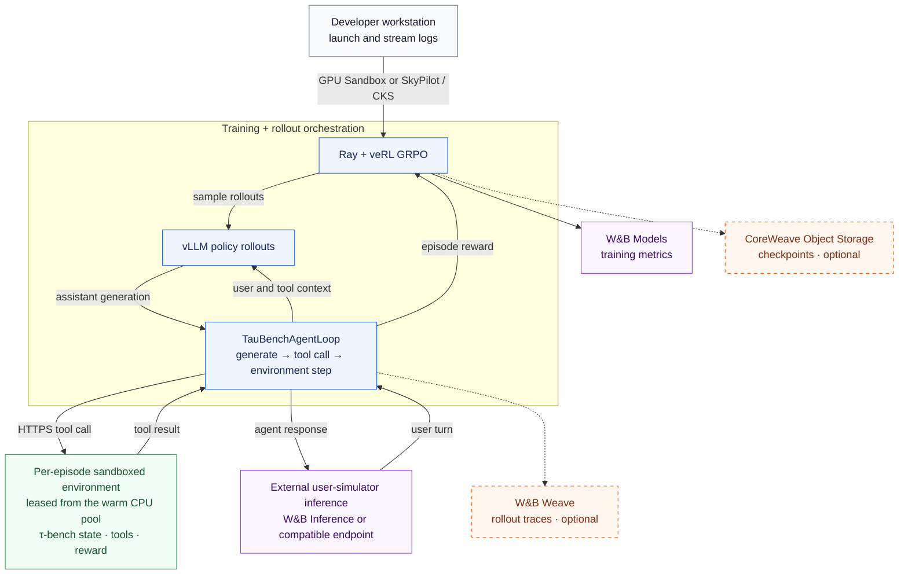

# taubench-verl: RL training on CoreWeave Sandboxes

Train a tool-using agent on [tau-bench](https://github.com/sierra-research/tau-bench) with [veRL](https://github.com/verl-project/verl) GRPO. By default, the trainer and vLLM rollouts run inside a GPU [CoreWeave Sandbox](https://docs.coreweave.com/products/sandboxes); an optional SkyPilot track runs them in a CKS pod. Each tau-bench environment runs in a warm pool of CPU sandboxes.

## What this recipe demonstrates

- GPU workloads in sandboxes: an 8x H100 veRL trainer launched with one Python call
- A warm pool of CPU sandboxes as isolated RL environments, placed on serverless, on your CKS cluster, or CKS with serverless spillover, switched by one env var
- Training metrics in [W&B Models](https://docs.wandb.ai/models) and per-turn rollout traces in [W&B Weave](https://weave-docs.wandb.ai/), linked to the same run
- The tau-bench user simulated by [W&B Inference](https://docs.wandb.ai/inference) (serverless, OpenAI-compatible), traced automatically by Weave
- Checkpoint upload to [CoreWeave AI Object Storage](https://docs.coreweave.com/products/storage/object-storage/about)

## Architecture



Solid arrows show runtime control and data flow. Dashed arrows show optional exports.

A rollout is one logical trajectory across these services. Each active episode leases one CPU sandbox for all of its tool calls; policy inference and rollout orchestration remain in the trainer runtime.

### Deployment options

| Concern | Default | Alternatives and configuration |
|---|---|---|
| Trainer runtime | GPU Sandbox via `python scripts/launch_gpu_sandbox.py` | CKS GPU pod via `sky launch` and `skypilot/verl-taubench-sandbox.yaml` |
| CPU environment pool | CoreWeave serverless using `WANDB_API_KEY`: `CWSANDBOX_PLACEMENT_MODE=serverless` | Serverless CW auth: `CWSANDBOX_SERVERLESS_AUTH=coreweave` with `CWSANDBOX_API_KEY`. CKS only: use `CWSANDBOX_PLACEMENT_MODE=cks` with `CWSANDBOX_PLACEMENT_SPILLOVER=strict`; CKS-to-serverless spillover (the CKS default): omit the spillover setting or set it to `cks_then_serverless`. `CWSANDBOX_RUNNER_IDS` can pin either CKS mode. |
| User simulator | W&B Inference | Any hosted OpenAI-compatible endpoint or self-hosted SkyServe deployment via `TAUBENCH_SIMULATOR_URL` |
| Rollout traces | Disabled | W&B Weave via `TRACE_BACKEND=weave` |
| Checkpoints | Trainer-local directory | At each `trainer.save_freq`, upload to CoreWeave AI Object Storage and log a W&B reference artifact when `CW_ACCESS_KEY` and `CW_SECRET_KEY` are set |

Rewards are computed by tau-bench at episode end and flow back through veRL's `AgentLoopOutput.reward_score`. Policy tokens remain in the selected trainer runtime (the GPU sandbox or CKS pod), while tau-bench environment state remains in the CPU sandbox pool.

## Prerequisites

- A CoreWeave account with Sandboxes enabled and quota for 8x H100 plus serverless CPU sandboxes. See [Sandboxes get started](https://docs.coreweave.com/products/sandboxes/get-started).
- A CoreWeave API access token from the [Tokens page](https://console.coreweave.com/tokens) for the GPU Sandbox track or CKS CPU placement.
- A [W&B account](https://wandb.ai) and API key, and a HuggingFace token for model download.
- The user simulator runs on W&B Inference by default and authenticates with your W&B API key; no extra key needed (OpenAI or self-hosted endpoints are options, see `.env.example`).
- Python 3.11 or 3.12 and [uv](https://docs.astral.sh/uv/) on your machine.
- Budget for GPU runtime, CPU pools, storage, and simulator tokens. Cost and runtime depend on dataset size, rollout count, pool sizing, and provisioning retries.

## Setup

### 1. Sandbox runner (only for CKS placement)

The default configuration places the CPU env pool on CoreWeave serverless capacity and needs no cluster setup. To place sandboxes on your own CKS cluster instead, install a [managed sandbox runner](https://docs.coreweave.com/products/sandboxes/operations/managed-runners) on it and attach a policy and profiles:

```bash
cwic sandbox runner list                       # find your runner name
cwic sandbox runner policy edit "<runner>" -f infra/runner-policy.yaml
```

`infra/runner-policy.yaml` caps sandbox resources and network egress for this recipe's two shapes (GPU trainer, CPU env pool). `infra/profile-h100.yaml` and `infra/profile-cpu.yaml` are matching [profile](https://docs.coreweave.com/products/sandboxes/profiles/profiles) examples; edit the node selectors to your node pool before binding them. GPU trainer placement on CKS also works without HTTPS endpoint routes; the CPU env pool on CKS requires Gateway API infrastructure on the cluster (the env servers need public HTTPS service URLs).

### 2. Environment

```bash
cp .env.example .env    # then fill it in; every variable is documented inline
uv venv --python 3.12
source .venv/bin/activate
uv pip install -e ".[dev,sandbox]"
set -a; source .env; set +a
unset WANDB_RUN_ID             # fresh SDK-generated ID for a new run
```

The recipe uses `cwsandbox>=1.12.0,<2.0.0` directly, not the retired `wandb[sandbox]` wrapper, and pins `wandb==0.29.0`. Both launch paths use `wandb.sdk.lib.runid.generate_id` when `WANDB_RUN_ID` is unset; removing it from `.env` does not clear an older shell export. Preserve an existing ID only for intentional run reuse or checkpoint-reference recovery.

For orgs without a cwsandbox secret store, keep `TRAINER_SECRET_STORE=none` (the `.env.example` default) to inject credentials from the host environment. A gateway create error alone does not identify a secret-store problem.

### Prebuilt CPU environment image

Build and test a CPU-only image with the pinned tau-bench dependency already
installed. This avoids a GitHub clone and pip install in every environment
sandbox. Docker must be running; the script targets `linux/amd64`, including
when built from an Apple Silicon Mac.

```bash
docker login <registry>
bash scripts/build_env_image.sh <registry>/<namespace>/taubench-env:v1 --push
```

Publish to a registry location that serverless sandboxes can pull without
credentials (a public repository). Omit `--push` to build
and test locally only. The isolated build context includes no recipe source,
`.env`, credentials, datasets, or checkpoints. The environment server is still
uploaded by the backend at runtime; the image contains only Python and public
tau-bench dependencies.

To use your image, set these in `.env` and re-source it before a new launch.
Use the immutable digest printed by `docker push`:

```dotenv
TAUBENCH_ENV_IMAGE=<registry>/<namespace>/taubench-env@sha256:<digest>
TAUBENCH_ENV_CPU=4
TAUBENCH_ENV_MEMORY=8Gi
```

The resource settings are per CPU sandbox, not GPU trainer settings. Existing
sandboxes are unchanged. Leaving the image unset retains `python:3.11` plus
startup installation. Rebuild under a new tag when dependencies change.

`TAUBENCH_POOL_SIZE` is per rollout worker and per domain/split pool, not a global cap (tool default: 64; SkyPilot YAML: 128). Eight workers with 128 train and 128 validation sandboxes each can hold 2,048 sandboxes. Size for each worker's concurrent episodes and account for idle validation pools; more resources per sandbox do not remove service capacity limits.

### 3. Preflight (before paying for GPUs)

Provisions one CPU sandbox, drives a full `/health -> /reset -> /step -> /reward` episode, and tears it down:

```bash
python -m verl_taubench.sandbox.preflight --domain retail --task-split train
```

Expected output:

```
[preflight] provisioning 1 sandbox (domain=retail split=train)...
[preflight] sandbox 3d4f2f41-... ready at https://8080-3d4f2f41-....cwsandbox.com in 52.3s
[preflight] /health   -> {'status': 'ok', ...}
[preflight] /reward   -> 0.0 (info keys: ['gt_data_hash', 'r_actions'])
[preflight] OK in 53.0s
```

On macOS, if the preflight fails with `CERTIFICATE_VERIFY_FAILED`, point Python at a CA bundle first: `export SSL_CERT_FILE=$(python -c "import certifi;print(certifi.where())")`.

## Run

### Launch training (GPU sandbox track)

```bash
export TRACE_BACKEND=weave     # optional: per-turn rollout traces in Weave
export CWSANDBOX_RUNNER_IDS=your-runner-name  # e.g. my-cluster; required
export CWSANDBOX_PLACEMENT_MODE=serverless   # CPU environments only
python scripts/launch_gpu_sandbox.py --secret-store none \
  --hydra-override trainer.total_epochs=1
```

The launcher prints the W&B run URL up front, mounts this directory into the sandbox, and streams trainer logs:

```
wandb run id 99ea4f13: https://wandb.ai/<entity>/<project>/runs/99ea4f13
...
Starting Ray head on port 6379...
wandb: View run at https://wandb.ai/<entity>/<project>/runs/99ea4f13
weave: View Weave data at https://wandb.ai/<entity>/<project>/weave
step:1 - ... actor/entropy:0.273 ... perf/throughput:1093 ...
```

Startup includes dependency installation, dataset preprocessing, model download, and CPU pool prewarm. A single-sandbox preflight does not guarantee that a large pool can provision without retries.

GPU placement is always strict CKS on `CWSANDBOX_RUNNER_IDS`; the launcher refuses an empty pin instead of choosing another cluster. `CWSANDBOX_PLACEMENT_MODE` and `CWSANDBOX_PLACEMENT_SPILLOVER` configure the CPU pool only. The GPU memory default is 256Gi, matching `infra/runner-policy.yaml`; larger `--memory` requests require a compatible live runner policy.

The GPU launcher waits up to 15 minutes for the sandbox to reach running state. Status RPCs have a 30-second timeout and the SDK retries transient polling failures for up to five minutes per failure burst, on the same sandbox (no duplicate GPU create). Persistent failures or the startup deadline still trigger best-effort cleanup. This tolerates temporary status-service interruptions; it does not resolve capacity limits or a sustained gateway outage.

Lifecycle events (sandbox created, env server ready, pool prewarmed, Ray up, checkpoint upload, cleanup) are printed as `[taubench] ...` lines. To follow just those: `python scripts/launch_gpu_sandbox.py ... | grep -E "taubench|step:"`.

### Choose where the CPU env pool runs

One env var; no code changes:

| Mode | Setting |
|---|---|
| Serverless (default) | `CWSANDBOX_PLACEMENT_MODE=serverless` |
| Your CKS cluster only | `CWSANDBOX_PLACEMENT_MODE=cks`, `CWSANDBOX_RUNNER_IDS=<runner-name>`, and `CWSANDBOX_PLACEMENT_SPILLOVER=strict` |
| CKS with spillover | `CWSANDBOX_PLACEMENT_MODE=cks` plus `CWSANDBOX_PLACEMENT_SPILLOVER=cks_then_serverless` |

Serverless authentication defaults to `WANDB_API_KEY`. To use a CoreWeave API key instead, set `CWSANDBOX_API_KEY` and export `CWSANDBOX_SERVERLESS_AUTH=coreweave`, or pass `--serverless-auth coreweave` to the GPU launcher, preflight, or cleanup command. `--serverless-auth wandb` selects W&B authentication again. Cleanup uses the same selection, so keep the env setting when running cleanup separately. GPU trainer creation on CKS continues to use `CWSANDBOX_API_KEY`; W&B tracking and the default user simulator still need `WANDB_API_KEY`, independently of sandbox authentication.

### SkyPilot track (optional)

Run the trainer as a regular CKS pod instead of a GPU sandbox; the CPU env pool is still sandboxes. This track can use the [LOTA](https://docs.coreweave.com/products/storage/object-storage/improving-performance/about-lota) endpoint for accelerated model and checkpoint reads (sandboxes cannot reach the node-local LOTA proxy and use the public endpoint).

Run from this recipe directory after the environment setup above. SkyPilot needs a valid local kubeconfig, `socat`, and GNU `netcat`; it does not use `CWSANDBOX_API_KEY` to provision the trainer pod. For macOS and a local SkyPilot API server:

```bash
uv tool install "skypilot[kubernetes]>=0.9.0"   # isolated: skypilot pins click<8.2, wandb 0.29 needs >=8.2
brew install socat netcat
export PATH="$(brew --prefix netcat)/bin:$PATH"
export KUBECONFIG="$HOME/.kube/config"  # or your actual local kubeconfig
export SSL_CERT_FILE="$(python -c 'import certifi; print(certifi.where())')"
kubectl config get-contexts -o name
export SKYPILOT_CONTEXT=my-cluster_US-EAST-04A  # replace with your context
sky api start
sky check k8s --config "kubernetes.allowed_contexts=[$SKYPILOT_CONTEXT]"
```

Wait for Kubernetes to show `enabled`. If the API server was already running with an incorrect PATH or kubeconfig, run `sky api stop` then `sky api start` and repeat the check. A Linux path such as `/home/.../.kube/config` will not work on macOS.

Set `CW_BUCKET` to an existing bucket accessible with your storage keys; the YAML's `verl-taubench-checkpoints` value is an example, not an automatically created bucket. Then launch with the prebuilt image configured above:

```bash
sky launch -c taubench-verl skypilot/verl-taubench-sandbox.yaml \
  --infra "k8s/$SKYPILOT_CONTEXT" \
  --config "kubernetes.allowed_contexts=[$SKYPILOT_CONTEXT]" \
  --secret WANDB_API_KEY --secret HF_TOKEN \
  --secret CW_ACCESS_KEY --secret CW_SECRET_KEY \
  --env WANDB_ENTITY --env CW_BUCKET \
  --env TAUBENCH_ENV_IMAGE --env TAUBENCH_ENV_CPU --env TAUBENCH_ENV_MEMORY \
  --env CWSANDBOX_PLACEMENT_MODE=serverless \
  --env CWSANDBOX_SERVERLESS_AUTH=wandb \
  --env TOTAL_EPOCHS=1
sky logs taubench-verl
```

For serverless CW authentication, replace `--env CWSANDBOX_SERVERLESS_AUTH=wandb` with `--env CWSANDBOX_SERVERLESS_AUTH=coreweave` and add `--secret CWSANDBOX_API_KEY`. For CKS CPU placement, explicitly pass its mode, runner pin, spillover choice, and API key instead.

Sourcing `.env` does not automatically forward every value to SkyPilot. Add `--env TAUBENCH_POOL_SIZE=64`, `--env TRACE_BACKEND=weave`, or other overrides as needed. The YAML defaults to LOTA; pass `--env CW_ENDPOINT=https://cwobject.com` to use the public storage endpoint. Its preprocessing creates 50 validation tasks when the test parquet is absent; this count is independent of pool size. Setup installs the recipe's W&B pin and verifies its run-ID API. After setup changes, rerun `sky launch` without `--no-setup`; `sky exec` skips setup.

To self-host the user simulator instead of a hosted API, deploy `skypilot/taubench-simulator.yaml` with [SkyServe](https://docs.skypilot.co/en/latest/) and set `TAUBENCH_SIMULATOR_URL` to its endpoint.

## Results

- Sandbox metrics: the CPU pool uses `cwsandbox.Session(report_to=["wandb"])` for the SDK's own `cwsandbox/*` creation, startup, and exec metrics. There is no custom sandbox metric collection or HTTP-action instrumentation. SDK snapshots are published after provisioning and flushed on session close; counters accumulate per session, not as a combined total across Ray workers. Warm-pool HTTP traffic does not create new SDK exec metrics. Online workers join the training run in W&B shared mode without owning its finish state; veRL's training charts retain their `training/global_step` axis. Offline/disabled modes do not open worker reporting runs. These metrics work with either sandbox auth choice. W&B Automatic workspaces generate panels for logged metrics; Manual workspaces need panels added or a switch to Automatic (which resets the panel layout).
- Training metrics: the W&B run URL the launcher prints. Reward metrics are `critic/score/*` per step and `val-core/tau-bench-retail-test/reward/mean@1` at validation. Validation reward is always strict task success. Training reward adds graded partial credit for failed episodes (`TAUBENCH_PARTIAL_CREDIT`, default 0.3): progress over the ground-truth tool actions and the required outputs, so rollouts of the same task earn different rewards and GRPO has a gradient. Watch `critic/advantages/max`: if it sits at exactly 0, the policy is not learning. Per-episode `info` carries `success`, `action_progress`, and `output_progress` for debugging.
- Rollout traces: the Weave tab of the same project, linked to the training run at the matching step. Each episode is a `taubench.episode` (agent) trace. The `taubench.dialogue` span is the complete semantic rollout: the Qwen policy is `assistant`, the simulated customer is `user`, and environment API results are `tool`. Per-turn spans retain the forensic detail: `policy.chat` is the exact role-preserving request Qwen saw, `taubench.step_env` records the action and observation, and the simulator's autopatched LLM call includes its token usage. Inside that simulator child call only, its generated customer text is an `assistant` output because that span uses the simulator model's local API frame.
- Checkpoints: each scheduled save uploads asynchronously to `s3://$CW_BUCKET/checkpoints/<project>/<experiment>/global_step_<N>` and, after upload succeeds, is logged in the active W&B run as `<experiment>-checkpoints` with `latest` and `step-<N>` aliases. W&B stores an external reference; checkpoint bytes remain in CoreWeave AI Object Storage. The post-training pass is idempotent recovery and resumes the run only if a reference was not logged successfully. Without storage credentials, checkpoints remain local: ephemeral in a GPU sandbox, or on the SkyPilot pod until teardown.

### Checkpoint recovery (SkyPilot)

Training can finish all steps while the job still fails on upload. For `NoSuchBucket`, check the bucket, endpoint, and credentials; do not tear down the cluster or rerun training just to recover its checkpoint. SSH into the existing cluster, ensure the storage and W&B credentials are exported securely, and run from `~/sky_workdir`:

```bash
python scripts/upload_checkpoints.py \
  --local-dir "checkpoints/<project>/<experiment>" \
  --bucket "<existing-bucket>" --endpoint https://cwobject.com \
  --prefix "checkpoints/<project>/<experiment>" \
  --project "<project>" --experiment "<experiment>" \
  --wandb-entity "<entity>" --wandb-run-id "<original-run-id>"
```

Use the original project, experiment, and run ID from the training logs. Verify the upload and reference artifact before teardown.

### Provisioning failures

`could not provision sandbox after 3 attempts` wraps the underlying create or startup error. The pool currently retries without backoff; prewarming does not eliminate later creates when idle capacity is exhausted or unhealthy sandboxes need replacement. For `the selected runner failed to place the sandbox`, inspect the accompanying backend details; the message alone does not prove a quota, capacity, or authentication problem. Failed rollouts may be dropped and the batch padded so training can continue; check failure counts, not just the progress bar.

## Cleanup

- Teardown is automatic: the launcher reaps the CPU pool by the run's tag in a `finally`, on success, crash, or Ctrl+C. The trainer sandbox stops with it.
- Every sandbox also carries the stable `verl-taubench` tag, so leftovers are reapable even when the run tag is lost:

```bash
python -m verl_taubench.sandbox.cleanup --tag "<TAUBENCH_ENV_TAG>"   # one run
python -m verl_taubench.sandbox.cleanup --all          # all runs of this recipe
```

Prefer the exact run tag. `--all` can stop another active run of this recipe; keep the same placement/auth settings used at launch.

- SkyPilot track: the training script reaps its CPU sandboxes, but the GPU pod remains. After confirming checkpoint persistence, use `sky down <cluster>` and `sky serve down <service>` if you deployed the simulator.
- All sandboxes carry `max_lifetime_seconds` caps (12h) as a backstop.

## Local smoke tests (no cloud)

```bash
python -m pytest tests/smoke/ -q
```

Fake SDK and in-process env servers; no sandboxes are created and no APIs are billed.

## Layout

```
scripts/launch_gpu_sandbox.py     host CLI: trainer sandbox launch + log streaming
scripts/train_grpo.sh             sandbox main process: Ray, veRL, checkpoint recovery
scripts/preprocess_taubench.py    tau-bench tasks -> parquet
scripts/build_env_image.sh        build, smoke-test, and optionally push the CPU image
scripts/upload_checkpoints.py     recover checkpoint uploads and W&B references
docker/taubench-env/              isolated CPU image build context
verl_taubench/checkpoint_artifacts.py  object upload + W&B reference artifacts
verl_taubench/agent/              TauBenchAgentLoop (veRL multi-turn agent loop)
verl_taubench/tools/              SandboxTauBenchTool (leases env sandboxes per episode)
verl_taubench/sandbox/            pool, env server, launcher, preflight, cleanup
config/tool_config/               veRL tool config (pool size, placement, simulator)
verl_taubench/trainer/            GRPO config + checkpoint-uploading trainer hook
skypilot/                         optional pod-based trainer + self-hosted simulator
infra/                            runner policy and profile examples for CKS placement
```
